# 第一次取样2022/3/20

在凋落物分解60天后取回七个不同处理下分解两个月的互花米草凋落物（茎35个，叶28个），在实验室分析测定其凋落物的*C**O*2的释放速率。

凋落物*C**O*2释放速率的计算方法：
$$
y\_T = \\frac{(dc/dt)×(M×V×P×{T\_0})}{(m×{V\_0}×{P\_0}×T)}
$$
式中：
*y**T*为*C**O*2的释放速率(*μ**g**C**g*−1*d**r**y**m**a**s**h*−1)；

*d**c*/*d**t*是气体浓度随时间变化的线性回归斜率(*p**p**m**C**m**i**n*−1);

*M*为*C**O*2的摩尔质量,44*g*/*m**o**l*;

*V*为气室的体积,*m*3;

*P*为采样时的气压,kPa;

*T*0为标准状态下的温度,℃;

*V*0为标准状况下*C**O*2的摩尔体积,22.4*L*/*m**o**l*;

*P*0为标准大气压1.013*k**P**a*;

*T*为采样时的温度,℃;

*m*为放入的凋落物质量(干重),g。

<table>
<thead>
<tr class="header">
<th style="text-align: center;">Group</th>
<th style="text-align: center;">stem</th>
<th style="text-align: center;">leaf</th>
</tr>
</thead>
<tbody>
<tr class="odd">
<td style="text-align: center;">CK</td>
<td style="text-align: center;">1366</td>
<td style="text-align: center;">1098</td>
</tr>
<tr class="even">
<td style="text-align: center;">N1</td>
<td style="text-align: center;">1036</td>
<td style="text-align: center;">974.8</td>
</tr>
<tr class="odd">
<td style="text-align: center;">N2</td>
<td style="text-align: center;">753.2</td>
<td style="text-align: center;">770.2</td>
</tr>
<tr class="even">
<td style="text-align: center;">P1</td>
<td style="text-align: center;">736.8</td>
<td style="text-align: center;">780.2</td>
</tr>
<tr class="odd">
<td style="text-align: center;">P2</td>
<td style="text-align: center;">665.8</td>
<td style="text-align: center;">1205</td>
</tr>
<tr class="even">
<td style="text-align: center;">NP1</td>
<td style="text-align: center;">676.4</td>
<td style="text-align: center;">952</td>
</tr>
<tr class="odd">
<td style="text-align: center;">NP2</td>
<td style="text-align: center;">708.7</td>
<td style="text-align: center;">877.7</td>
</tr>
</tbody>
</table>

表1
不同添加下处理下的凋落物*C**O*2浓度随时间的变化的线性回归斜率(*p**p**m**C**m**i**n*−1)

不同添加处理对凋落物的*C**O*2释放速率具有影响，在分解两个月之后茎凋落物同CK组相比，不同的添加处理均降低了凋落物的*C**O*2释放速率，在N和P单独添加处理中其影响程度均随着添加浓度的增加而增强。而叶凋落物除P2组凋落物的*C**O*2释放速率高于CK组之外其余均低于CK组。

在相同处理下茎和叶凋落物的*C**O*2释放速率具有差异，除CK组茎凋落物的*C**O*2释放速率大于叶之外，其余六个氮磷添加处理下叶凋落物的*C**O*2释放速率均大于茎凋落物。从下图（图1~7）中可以看出在相同条件下测定的叶凋落物*C**O*2的浓度均高于茎凋落物。

产生这种现象的原因是否是由于叶凋落物比茎凋落物更加容易分解？在叶凋落物上附着的微生物数量显著高于茎凋落物？

后续通过测定凋落物的碳氮磷含量、质量损失来进一步研究是氮磷添加是如何影响凋落物分解。

还需计算*C**O*2的释放速率

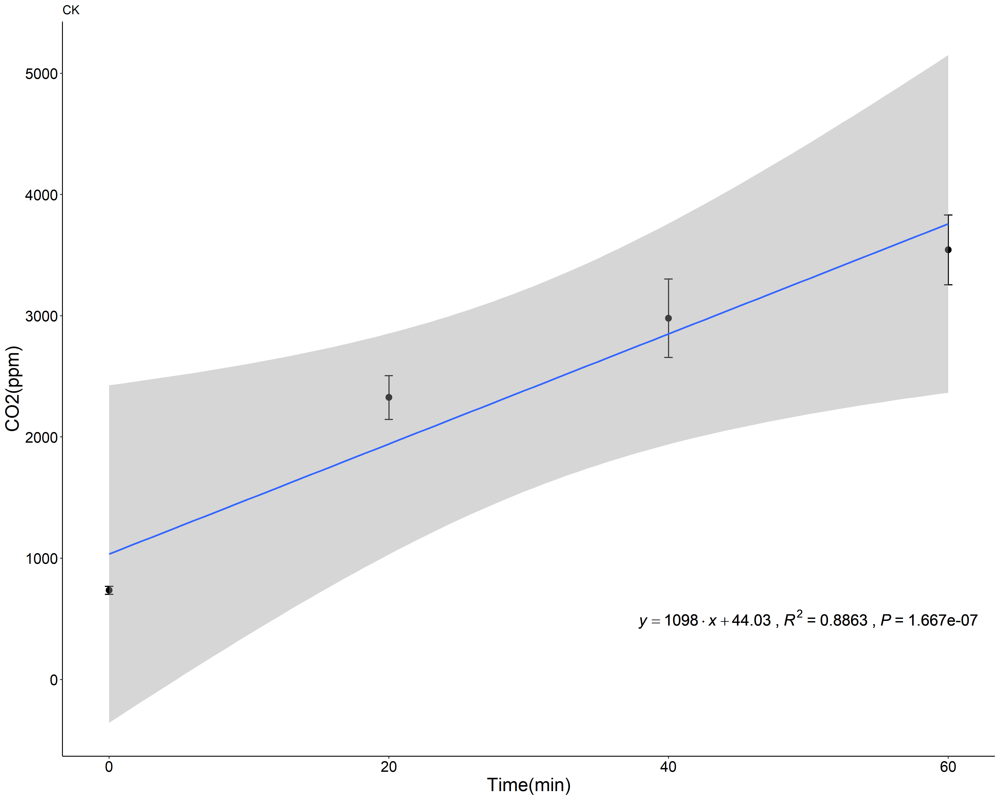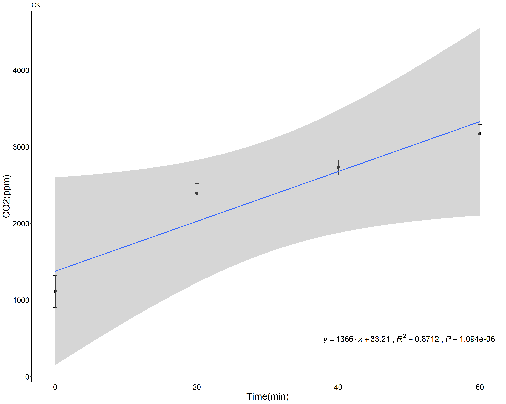

图1 CK处理下叶（左）和茎（右）凋落物附着物呼吸速率

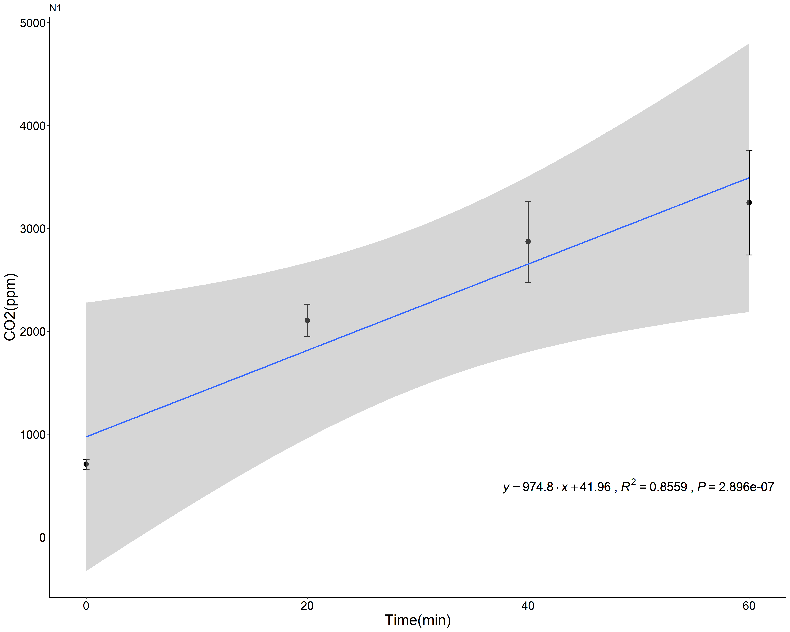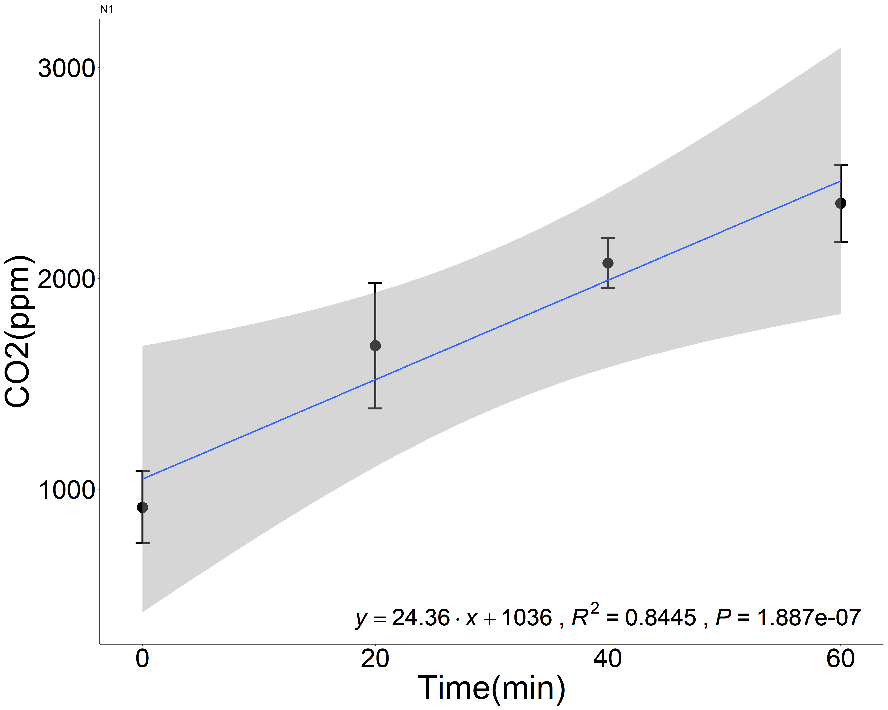

图2 N1处理下叶（左）和茎（右）凋落物附着物呼吸速率

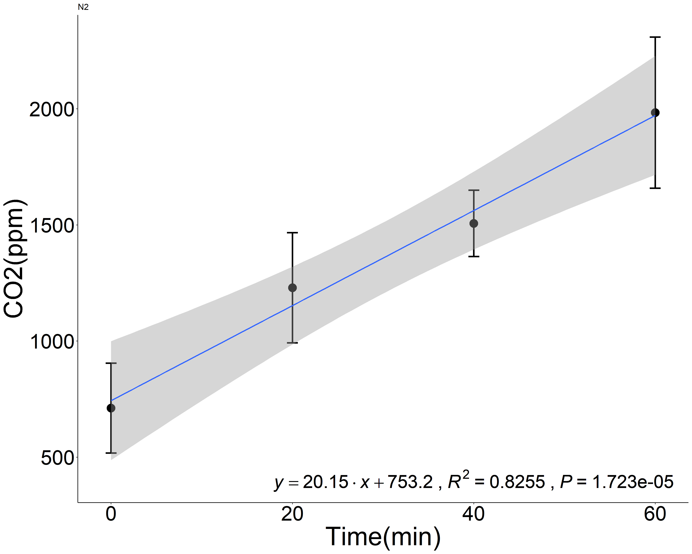

图3 N2处理下叶（左）和茎（右）凋落物附着物呼吸速率

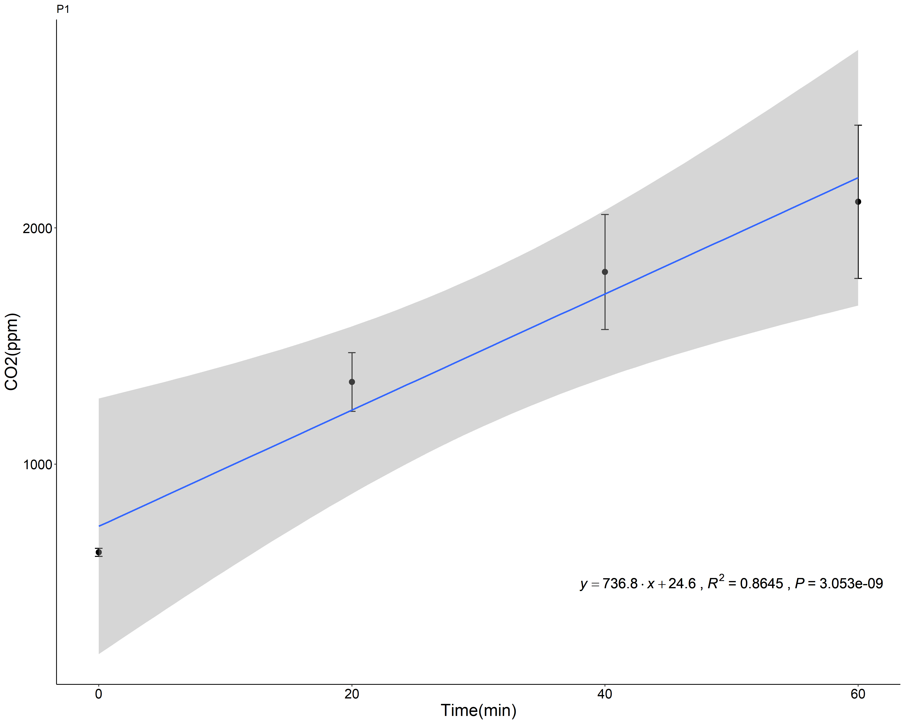

图4 P1处理下叶（左）和茎（右）凋落物附着物呼吸速率

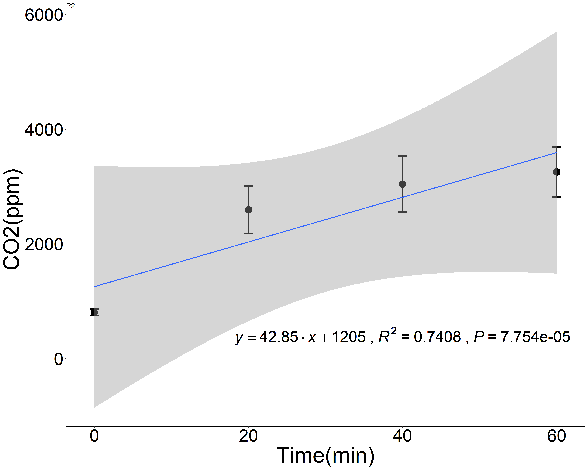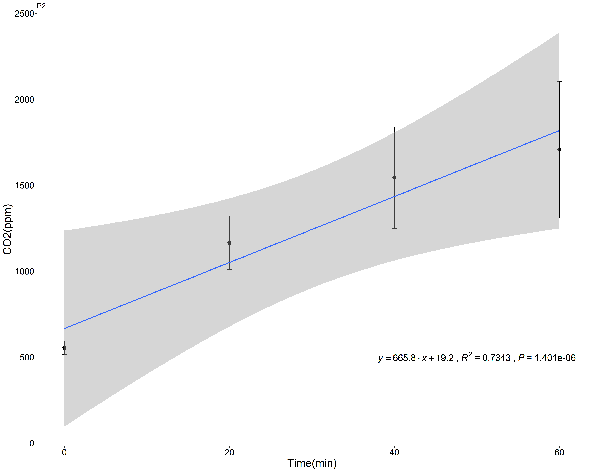

图5 P2处理下叶（左）和茎（右）凋落物附着物呼吸速率

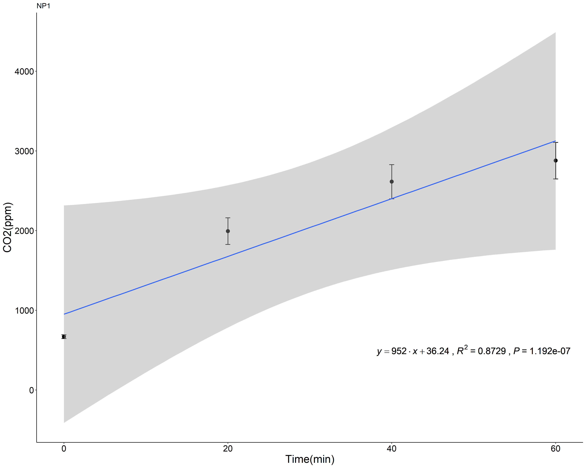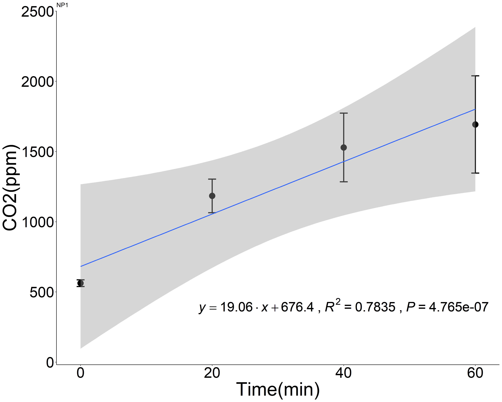

图6 NP1处理下叶（左）和茎（右）凋落物附着物呼吸速率

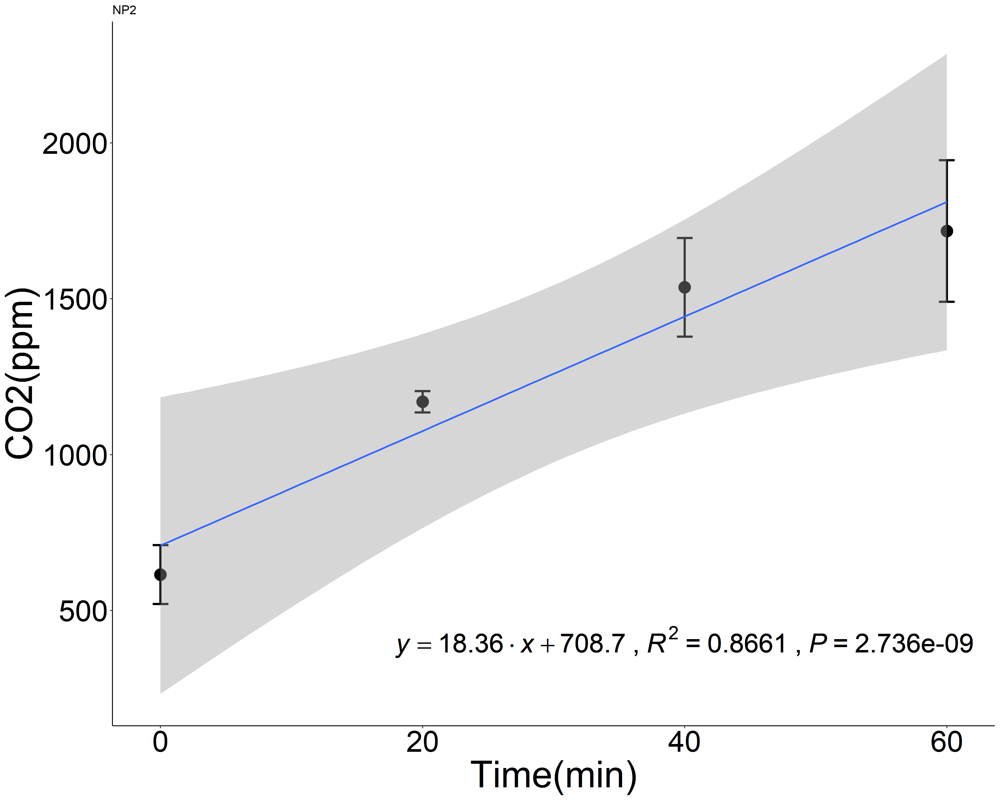

图7 NP2处理下叶（左）和茎（右）凋落物附着物呼吸速率

